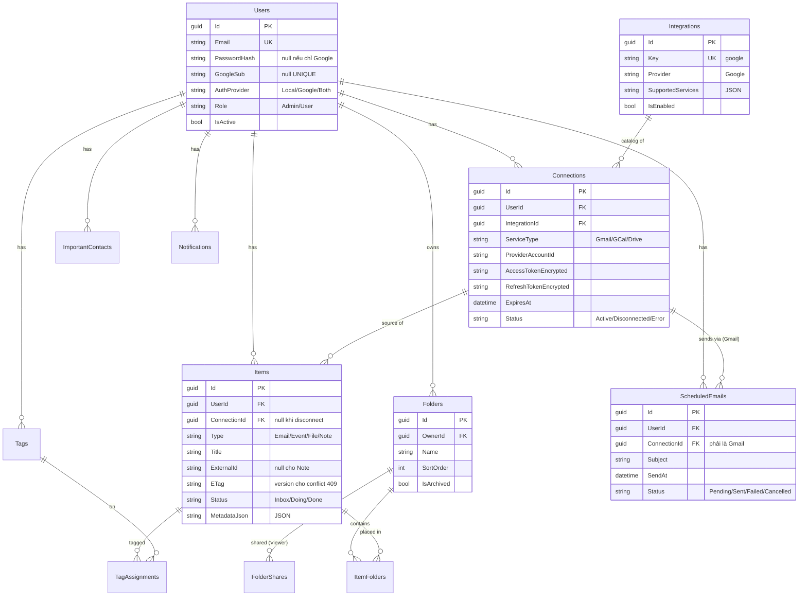

# Workspace Hub

Đồ án Fullstack ASP.NET (PRN232) · Nhóm 6 người · 60% Backend / 40% Frontend.

App gom **Gmail · Google Calendar · Google Drive** về 1 nơi, quản lý theo **Folder context** + giao diện **Kanban 3 cột** (Cần xem / Đang xử lý / Done), đồng bộ **2 chiều** với Google: đọc theo nhu cầu (on-demand) khi user mở list, ghi ngược lên Google ngay khi user thao tác (write-back synchronous). Có chia sẻ folder (Viewer-only), hẹn giờ gửi email (cron), và dashboard admin. Jira/Atlassian và webhook là phase sau (chưa code).

> Context cho dev + Claude Code: đọc [`CLAUDE.md`](CLAUDE.md) trước, chi tiết trong [`docs/`](docs/).

---

## 📚 Tài liệu

| File | Nội dung |
|---|---|
| [`CLAUDE.md`](CLAUDE.md) | Scope, sprint hiện hành, quy ước nền tảng |
| [`docs/SETUP.md`](docs/SETUP.md) | Chạy local đầy đủ, env, migration, OAuth setup |
| [`docs/DATABASE.md`](docs/DATABASE.md) | Schema (mô hình B — mỗi service 1 Connection) |
| [`docs/API.md`](docs/API.md) | Endpoint, request/response, status code |
| [`docs/SPRINTS.md`](docs/SPRINTS.md) | Ticket + assignee + status (đồng bộ Jira) |
| [`docs/CONVENTIONS.md`](docs/CONVENTIONS.md) | Coding style, naming, git |
| [`docs/CHANGELOG.md`](docs/CHANGELOG.md) | Lịch sử quyết định thiết kế |

---

## 🗂 Tech stack

### Backend (.NET 8)
- ASP.NET Core 8 Web API — kiến trúc **clean / layered**, 4 project (Domain / Application / Infrastructure / Api)
- EF Core 8 + **SQL Server** (dev + prod cùng engine; dev chạy Docker `wh-sqlserver`)
- JWT Bearer + BCrypt + **Google Sign-In** · Role string trên `Users` (Admin/User)
- **ASP.NET Data Protection** mã hoá OAuth token (không tự viết AES, không lưu key trong DB)
- OAuth Google trực tiếp (strategy pattern theo provider) · FluentValidation · Swagger
- Exception middleware (error format chuẩn) + request logging middleware

### Frontend
- Vite + React + TypeScript
- React Router · TanStack Query (server state) · axios (JWT interceptor)
- Tailwind CSS · react-hot-toast

---

## 📁 Cấu trúc thư mục

```
workspace-hub-plan/
├── CLAUDE.md, docs/                            # Tài liệu hiện hành
├── backend/                                    # ASP.NET Core 8 Web API
│   ├── WorkspaceHub.sln
│   ├── src/
│   │   ├── WorkspaceHub.Domain/          # Entities, Enums — không phụ thuộc gì
│   │   ├── WorkspaceHub.Application/     # Services, DTOs, Interfaces, OAuth, Validators, Mapping
│   │   ├── WorkspaceHub.Infrastructure/  # DbContext, EF config, Repositories, Gateways, Migrations
│   │   └── WorkspaceHub.Api/             # Controllers, Program.cs, Middleware, appsettings
│   └── tests/WorkspaceHub.Tests/
└── frontend/                                   # Vite + React + TypeScript
    └── src/{pages, components, layouts, context, hooks, lib, types}
```

---

## 🏛 Kiến trúc

```
Api (Controllers, Program.cs, Middleware, appsettings)
 └─→ Application (Services, DTOs, Interfaces, OAuth strategy, Validators, Mapping)
      └─→ Domain (Entities, Enums) ── không phụ thuộc gì
 Infrastructure (AppDbContext, EF config, Repositories, Gateways, Migrations)
      └─→ Application / Domain
```

- Luồng request: **Controller → Service → Repository → DbContext**. Controller mỏng, không chứa business logic.
- DTO tách khỏi Entity — không expose entity ra API. DI cho mọi service/repository (không `new` trong controller).
- Gateway (Gmail/Calendar/Drive) ở Infrastructure gọi Google API; Service điều phối sync (đọc on-demand) + write-back (ghi synchronous).

**Mô hình connection B:** mỗi service (Gmail / GCal / Drive) = 1 row `Connections` độc lập, token riêng, user authorize riêng từng service. Bật service = cấp full scope của service đó.

> ⚠️ **Google Sign-In ≠ Connect service.** Sign-In chỉ đăng nhập app (scope `openid email profile`), KHÔNG tạo Connection. Connect service mới cấp quyền đọc/ghi Gmail/GCal/Drive và tạo Connection. Disconnect service KHÔNG làm logout.

---

## 🛢 Sơ đồ ERD



> Quy ước nền tảng: PK `Guid`, enum lưu **string**, datetime `datetime2` **UTC**, JSON `nvarchar(max)`, **không soft-delete** (dùng `IsArchived`). Schema đầy đủ + constraint: [`docs/DATABASE.md`](docs/DATABASE.md).

---

## 🛠 Yêu cầu môi trường

| Tool | Version |
|---|---|
| .NET SDK | 8.x (SDK 10 build target `net8.0` cũng chạy — có `global.json`) |
| SQL Server | 2022 (dev chạy Docker) |
| Node.js | ≥ 20.x |
| Google Cloud project | OAuth credentials (xem [Cấu hình Google OAuth](#-cấu-hình-google-oauth)) |

---

## 🚀 Chạy local

Hướng dẫn đầy đủ (Windows + macOS, user-secrets, gotcha): [`docs/SETUP.md`](docs/SETUP.md).

### 1. SQL Server dev (Docker, 1 lần)

```bash
docker run -d --name wh-sqlserver -e ACCEPT_EULA=Y \
  -e MSSQL_SA_PASSWORD='Workspace#2026Dev' -p 1433:1433 \
  mcr.microsoft.com/mssql/server:2022-latest
```

### 2. Backend

```bash
cd backend
cp src/WorkspaceHub.Api/appsettings.Development.json.example \
   src/WorkspaceHub.Api/appsettings.Development.json
#  → sửa ConnectionStrings:Default + điền OAuth:google:ClientId/Secret

dotnet restore

# Apply migration (tạo DB). Hiện có 4 migration:
#   InitialCreate → UsersMultiAuth → ModelBConnections → RemoveClientCredentialsFromIntegration
dotnet ef database update \
  --project src/WorkspaceHub.Infrastructure \
  --startup-project src/WorkspaceHub.Api

dotnet run --project src/WorkspaceHub.Api
#  → http://localhost:5118/swagger   (https: 7010)
```

Health check: `GET /api/health` (AllowAnonymous) → `{ status: "Healthy", database: "Connected", userCount, serverTimeUtc }`.

> **Gotcha `dotnet ef`:** luôn kèm `--startup-project src/WorkspaceHub.Api` (hoặc set env `WORKSPACEHUB_CONNECTION`). Thiếu → design-time factory không thấy appsettings của Api, rơi về fallback `Trusted_Connection` → lỗi Kerberos trên macOS.

### 3. Frontend (terminal khác)

```bash
cd frontend
npm install
npm run dev        # http://localhost:5173
```

> Dev **không cần** set env: Vite proxy `/api` → `http://localhost:5118` (xem `vite.config.ts`). Prod mới cần `VITE_API_URL` trỏ tới backend đã deploy.

---

## 🔑 Biến môi trường / config

**Backend** — đọc theo thứ tự: env var → user-secrets → `appsettings.Development.json`. KHÔNG commit secret thật.

| Key (config) | Env var prod (`:` → `__`) | Bắt buộc | Mục đích |
|---|---|:---:|---|
| `ConnectionStrings:Default` | `ConnectionStrings__Default` | ✅ | Connection string SQL Server |
| `Jwt:Secret` | `Jwt__Secret` | ✅ | Ký JWT (≥ 32 ký tự) |
| `Jwt:Issuer` / `Jwt:Audience` | `Jwt__Issuer` / `Jwt__Audience` | | Mặc định `WorkspaceHub` |
| `Jwt:ExpiresIn` | `Jwt__ExpiresIn` | | Giây, mặc định `3600` |
| `OAuth:google:ClientId` | `OAuth__google__ClientId` | ✅ | Google OAuth Client ID |
| `OAuth:google:ClientSecret` | `OAuth__google__ClientSecret` | ✅ | Google OAuth Client Secret |
| `Google:RedirectUri` | `Google__RedirectUri` | ✅ | Callback URL (vd `http://localhost:5173/oauth/callback`) |
| `Cron:Secret` | `Cron__Secret` | ✅¹ | Header `X-Cron-Secret` bảo vệ `/api/internal/process-scheduled` |
| `OAuth:jira:ClientId/Secret` | `OAuth__jira__*` | | Đặt sẵn cho phase Jira (chưa dùng) |

¹ Bắt buộc nếu chạy scheduled email cron.

**Frontend** (`frontend/.env`):

| Key | Bắt buộc | Mục đích |
|---|:---:|---|
| `VITE_API_URL` | chỉ prod | Base URL API (dev dùng Vite proxy, bỏ trống) |

---

## 🔐 Cấu hình Google OAuth

1. [Google Cloud Console](https://console.cloud.google.com) → tạo project.
2. **APIs & Services → Library** → bật **Gmail API**, **Google Calendar API**, **Google Drive API**.
3. **OAuth consent screen** → External; thêm scope read-write (xem bảng dưới); thêm test user (email dùng để demo).
4. **Credentials → Create Credentials → OAuth client ID → Web application.**
5. **Authorized redirect URIs** → thêm:
   - Dev: `http://localhost:5173/oauth/callback`
   - Prod: `https://<domain>/oauth/callback`
6. Copy **Client ID** + **Client Secret** vào config (`OAuth:google:ClientId` / `ClientSecret`) — user-secrets khi dev, env var khi prod.

**Scope dùng** (mô hình B — mỗi service xin riêng full scope của nó):

| Mục đích | Scope |
|---|---|
| Google Sign-In (đăng nhập app) | `openid email profile` *(không tạo Connection)* |
| Connect Gmail | `gmail.modify gmail.send` *(đọc + nhãn/đọc/sao/thùng rác + gửi — KHÔNG sửa nội dung)* |
| Connect Calendar | `calendar` *(CRUD event đầy đủ)* |
| Connect Drive | `drive.file` *(rename / trash)* |

> Connection cũ connect trước migration mô hình B (scope readonly) phải **reconnect** mới dùng được write-back.

---

## 🔌 Danh sách endpoint chính

Đầy đủ request/response + status code: [`docs/API.md`](docs/API.md). Mọi route prefix `/api`, auth bằng JWT Bearer (trừ chỗ ghi *anonymous*). Lỗi trả body chuẩn `{ error, message, details[], traceId }`.

| Nhóm | Method & Path | Mô tả |
|---|---|---|
| **Auth** | `POST /api/auth/register` · `login` | Đăng ký / đăng nhập (BCrypt + JWT) — *anonymous* |
| | `GET /api/auth/me` · `POST /api/auth/logout` | Thông tin user hiện tại / logout |
| | `POST /api/auth/google/start` · `google/callback` | Google Sign-In (không tạo Connection) — *anonymous* |
| **Connections** | `POST /api/connections/oauth/start` · `oauth/callback` | Connect 1 service (mô hình B) → tạo Connection |
| | `GET /api/connections` | List connection (token đã mask) |
| | `POST /api/connections/{id}/refresh` · `/sync` | Refresh token / trigger sync thủ công |
| | `DELETE /api/connections/{id}` | Disconnect service đó (Items giữ lại, ConnectionId = NULL) |
| **Items** | `GET /api/items` | List + filter (folder/status/type/search) + paging, kèm ETag |
| | `GET /api/items/{id}` | Detail + body live từ provider |
| | `POST /api/items/note` · `POST /api/items/event` | Tạo Note (local) / tạo Event → đẩy lên Calendar |
| | `PATCH /api/items/{id}` | **Write-back** lên Google (email label/read/star/trash, event CRUD, file rename/trash) |
| | `PATCH /api/items/{id}/status` | Đổi cột Kanban (local) |
| | `DELETE /api/items/{id}` | Trash/xoá trên provider + local |
| **Folders** | `GET/POST /api/folders` · `PUT/DELETE /api/folders/{id}` | CRUD folder |
| | `POST/DELETE /api/folders/{id}/items[/{itemId}]` | Gán / gỡ item khỏi folder |
| **Scheduled** | `POST/GET /api/scheduled-emails` · `GET /{id}` | Tạo / list / xem email hẹn giờ (qua Connection Gmail) |
| | `PATCH /api/scheduled-emails/{id}/cancel` | Huỷ email chưa gửi |
| | `POST /api/internal/process-scheduled` | Cron gửi email (header `X-Cron-Secret`) |
| **Admin** | `GET /api/admin/users` · `GET /api/admin/stats` | List user + thống kê hệ thống — *Admin only* |
| | `PATCH /api/admin/integrations/{key}/enable` | Bật/tắt integration — *Admin only* |
| **Health** | `GET /api/health` | Healthcheck (`status` + `database`) — *anonymous* |

**Status code đáng chú ý** (write-back): `403` thiếu scope ghi · `409` conflict ETag · `502` provider lỗi · `422` business rule.

---

## 🌿 Git workflow

```
main      ← production
develop   ← branch tích hợp (default)
feature/* ← feature/SCRUM-x-mo-ta
```

1. Branch từ `develop` → code + commit (`feat:` / `fix:` / `refactor:` / `docs:` / `chore:`, gắn mã ticket: `SCRUM-x: ...`).
2. PR vào `develop`, ≥ 1 approve → merge.

---

## 👥 Team

| Tên | Vai trò |
|---|---|
| Hải | Lead — foundation, schema/migration, optimize |
| Lộc | Auth, conflict resolution (ETag), scheduled cron |
| Khánh | OAuth flow, scope |
| Vũ | Sync + write-back Google, scheduled email |
| Huy | Folders / Items / filter / Admin |
| Dũng | Frontend |

---

## ❓ Gặp vấn đề?

```bash
# BE không build
cd backend && dotnet clean && dotnet restore --force && dotnet build

# FE lỗi module
cd frontend && rm -rf node_modules package-lock.json && npm install

# Port bị chiếm (5118 BE / 5173 FE)
lsof -ti:5118 | xargs kill -9      # macOS/Linux
lsof -ti:5173 | xargs kill -9

# dotnet ef lỗi Kerberos / không thấy DB
# → thiếu --startup-project src/WorkspaceHub.Api (xem docs/SETUP.md)
```

Repo: https://github.com/callmehai/workspace-hub-plan · PR review: tag ae trong nhóm.
