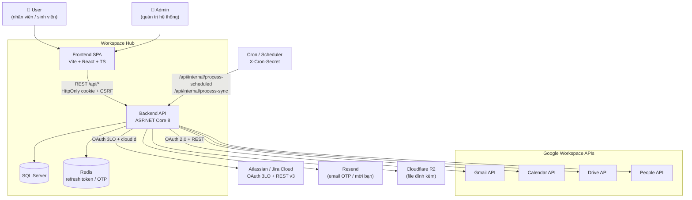
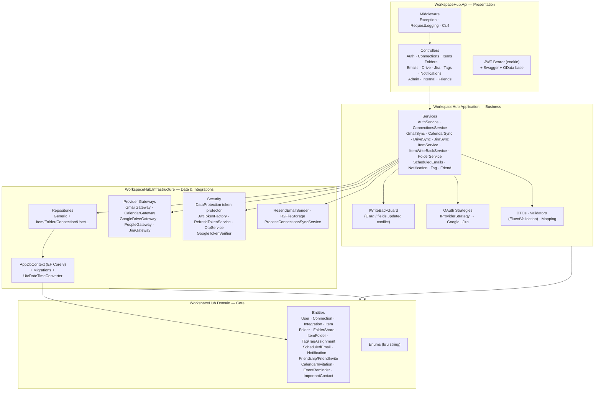
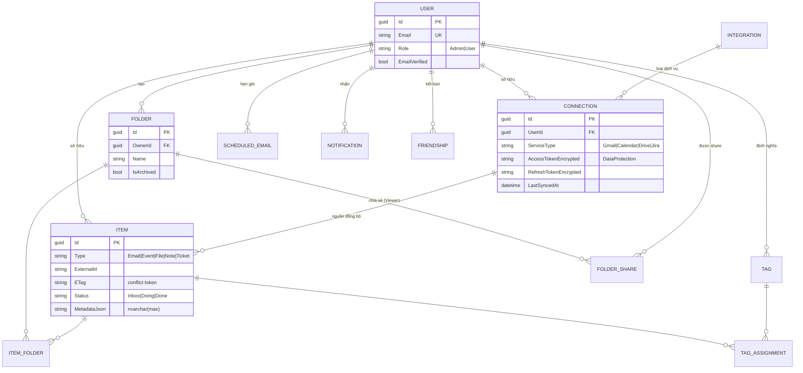
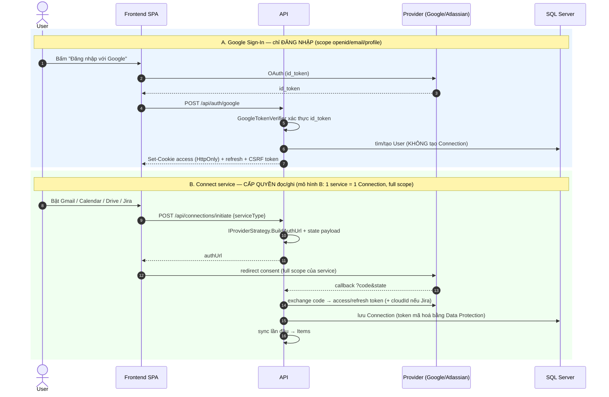
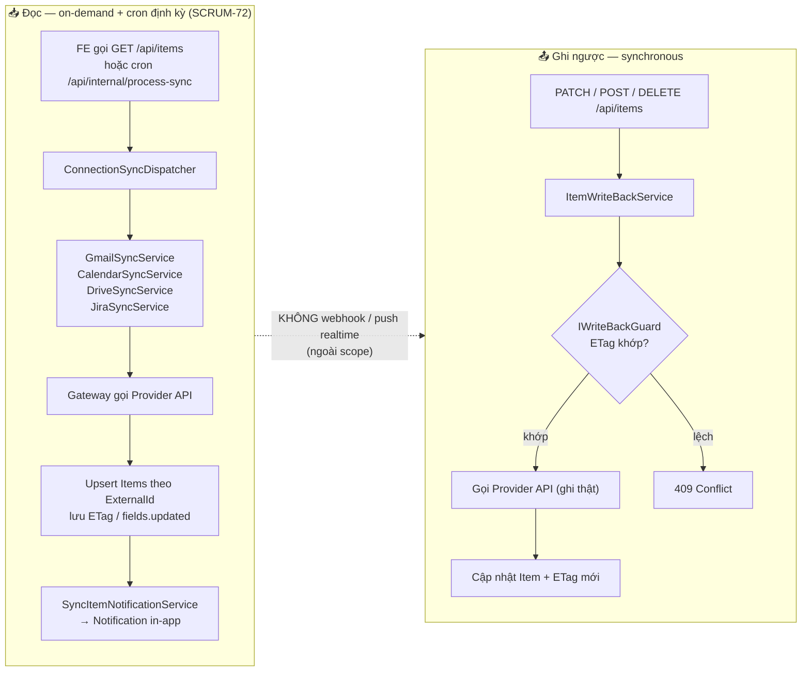
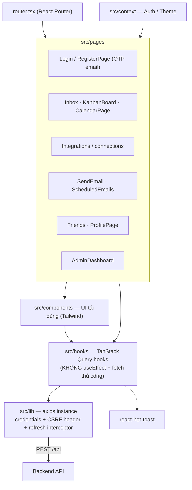
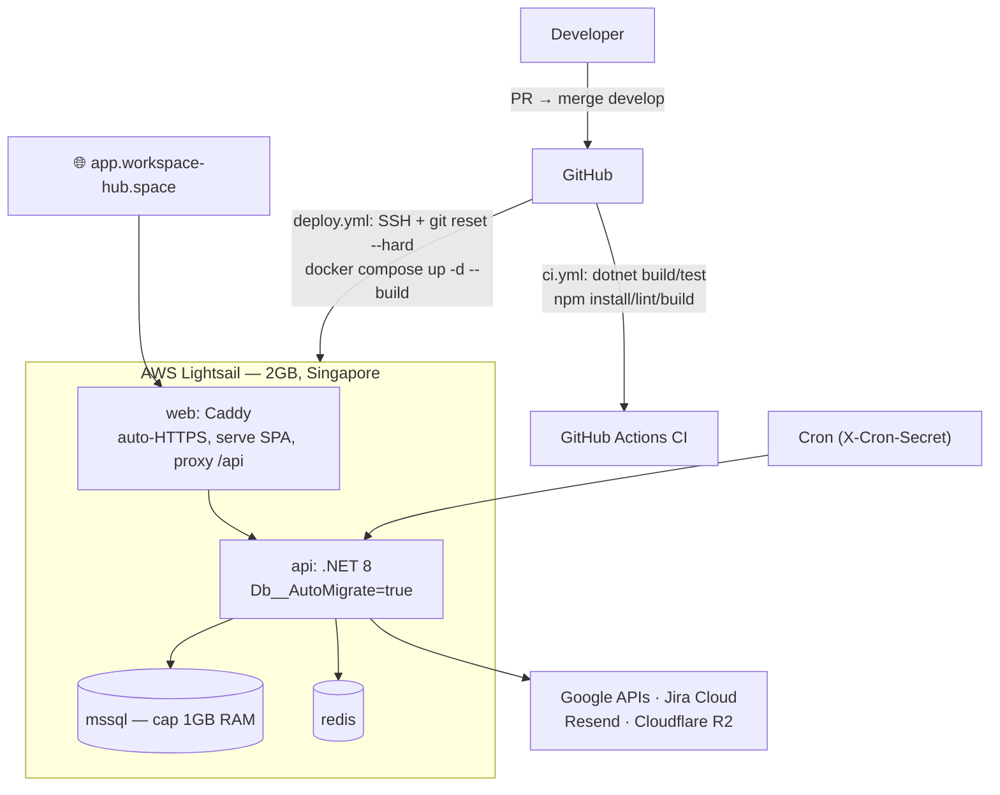

# Workspace Hub — System Architecture (Mermaid)

> Sơ đồ kiến trúc hệ thống, sinh từ code thực tế trên nhánh `develop`.
> Xem kèm: `docs/DATABASE.md` (schema), `docs/API.md` (endpoint), `docs/DEPLOY.md` (hạ tầng).
>
> **Bản draw.io (để chèn vào báo cáo / slide):** `docs/diagrams/backend-architecture.drawio` và
> `docs/diagrams/frontend-architecture.drawio` (kèm `.drawio.png` — mở lại bằng draw.io vẫn sửa được — và `.svg`).
>
> **Detailed Design (§4 của SDS):** 14 class + sequence diagram theo 7 nhóm use case ở
> `docs/diagrams/detailed-design/` — danh mục và cách sinh lại: `docs/diagrams/README.md`.

---

## 1. System Context — ai dùng, nối với gì

---

## 2. Kiến trúc backend — 4 project, layered

**Nguyên tắc phụ thuộc:** `Api → Application → Domain`, `Infrastructure → Application/Domain`.
Controller mỏng, không business logic. Không expose Entity ra API (luôn qua DTO). DI cho mọi service/repo.

---

## 3. Mô hình dữ liệu cốt lõi (rút gọn)

> Quy ước: PK `Guid`, timestamp UTC `datetime2`, enum lưu string, JSON `nvarchar(max)`,
> KHÔNG soft delete (dùng `IsArchived`), junction dùng composite PK.

---

## 4. Luồng OAuth — Sign-In vs Connect service (khác nhau!)

---

## 5. Luồng đồng bộ 2 chiều (đọc on-demand + write-back synchronous)

**Khả năng write-back theo loại item:**

| Item | Ghi được | Không ghi được |
|---|---|---|
| Email (Gmail) | label, read/unread, star, trash, **gửi mới** | sửa nội dung (Gmail immutable) |
| Event (Calendar) | CRUD đầy đủ | — |
| File (Drive) | rename, trash, upload, share | sửa nội dung file |
| Ticket (Jira) | tạo / update / xoá (ADF 2 chiều) | — |

Mã lỗi: `403` thiếu scope · `409` conflict ETag · `502` provider lỗi.

---

## 6. Kiến trúc frontend

---

## 7. Deployment — AWS Lightsail (Docker Compose)

> Secret prod nằm ở `.env` trên server — **không commit**. Chi tiết vận hành: `docs/DEPLOY.md`.
