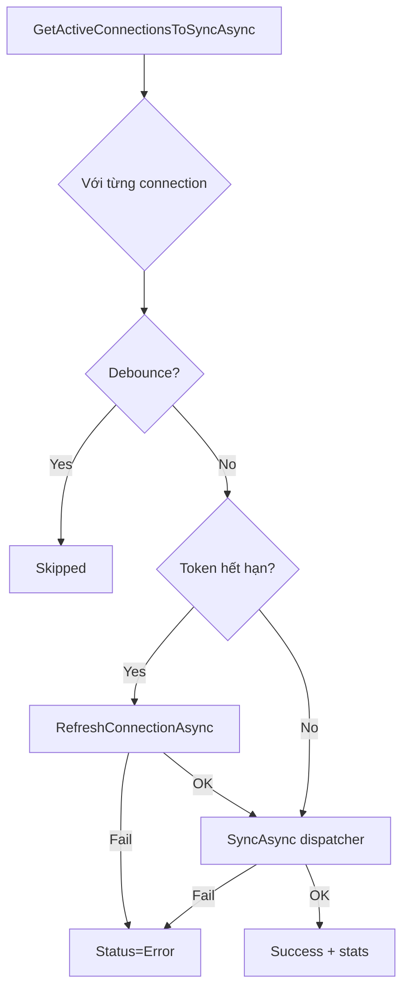

# Implementation Plan — Cron sync + FE auto-refresh (Option B)

> **Ticket Jira:** `SCRUM-72`  
> **Branch:** `feat/SCRUM-72-cron-sync-auto-refresh`  
> **Trạng thái:** 🔄 Commit 1 done — làm **đúng thứ tự commit** bên dưới.

---

## Mục tiêu

1. **BE:** Job cron định kỳ đồng bộ tất cả `Connections` Active (Gmail / GCal / Drive / Jira) về DB.
2. **FE:** Inbox, Kanban, Integrations **tự cập nhật** khi có data mới — không cần F5.

**Lưu ý scope:** Bổ sung sync định kỳ **ngoài** on-demand (SCRUM-16). Webhook/push realtime vẫn **ngoài scope**.

---

## Chuẩn bị trước khi code

```bash
git checkout develop
git pull
git checkout -b feat/SCRUM-72-cron-sync-auto-refresh
```

**Môi trường cần chạy khi test:**

- Docker: `wh-sqlserver` + `wh-redis`
- BE: `dotnet run --project src/WorkspaceHub.Api --launch-profile https`
- FE: `npm run dev` (PowerShell, port 5173)
- Config dev: `Cron:Secret`, `ConnectionStrings:Redis`

**Pattern tham chiếu trong repo (đọc trước khi code):**

| Pattern | File |
|---------|------|
| Cron endpoint + secret | `InternalController.cs` → `POST /api/internal/process-scheduled` |
| BackgroundService dev | `ScheduledEmailProcessorService.cs` |
| Batch query connections | `ConnectionRepository.GetActiveConnectionsToSyncAsync()` |
| Sync engine | `ConnectionSyncDispatcher.SyncAsync()` |
| FE polling | `ScheduledEmails.tsx` → `refetchInterval` |
| On-demand sync (user mở list) | `ItemService` → `ConnectionHealthChecker` |

---

## Quy ước commit

```
SCRUM-72: feat(sync): <mô tả ngắn>
SCRUM-72: feat(fe): <mô tả ngắn>
SCRUM-72: test(sync): <mô tả ngắn>
SCRUM-72: docs(sync): <mô tả ngắn>
SCRUM-72: fix(sync): <mô tả ngắn>
SCRUM-72: chore(postman): <mô tả ngắn>
```

**Sau mỗi commit:**

- [ ] BE: `dotnet build` pass (từ commit 1–6)
- [ ] BE tests: `dotnet test` pass (từ commit 5)
- [ ] FE: `npm run build` pass (từ commit 7)
- [ ] **Không commit** `appsettings.Development.json` có secret thật

---

## Tổng quan thứ tự commit

| # | Commit | Layer | Phụ thuộc |
|---|--------|-------|------------|
| 1 | Contract + config keys | BE | — |
| 2 | ProcessConnectionsSyncService | BE | 1 |
| 3 | Internal endpoint | BE | 2 |
| 4 | BackgroundService | BE | 3 |
| 5 | Unit tests BE | BE | 2–4 |
| 6 | Fix ConnectionHealthChecker (optional) | BE | 2 |
| 7 | Hook polling FE | FE | — |
| 8 | Inbox auto-refresh | FE | 7 |
| 9 | Kanban auto-refresh | FE | 7 |
| 10 | Integrations + invalidate items | FE | 7 |
| 11 | Sync indicator UI (optional) | FE | 8–10 |
| 12 | Documentation | Docs | 3–4 |
| 13 | Postman (optional) | Chore | 3 |

---

## Commit 1 — Contract + config keys

> **Thời gian ước tính:** ~15–20 phút  
> **Kết quả sau commit:** Solution build pass. Chưa có logic sync, chưa có endpoint — chỉ có interface + DTO + config keys.

---

### Bước 1.1 — Xác nhận đang ở đúng branch

```bash
cd C:\\workspace-hub-plan
git status
git branch
```

**Kỳ vọng:** đang ở `feat/SCRUM-72-cron-sync-auto-refresh`, working tree clean (hoặc chỉ có file plan này).

Nếu chưa tạo branch:

```bash
git checkout develop
git pull
git checkout -b feat/SCRUM-72-cron-sync-auto-refresh
```

---

### Bước 1.2 — Tạo thư mục DTO (nếu chưa có)

```bash
mkdir backend\\src\\WorkspaceHub.Application\\DTOs\\Sync
```

**Giải thích:** DTO sync đặt riêng folder `DTOs/Sync/` — tách khỏi `ScheduledEmails/`, giống cách repo tổ chức theo domain.

---

### Bước 1.3 — Tạo file `ConnectionSyncDetail.cs`

**Đường dẫn:**

```
backend/src/WorkspaceHub.Application/DTOs/Sync/ConnectionSyncDetail.cs
```

**Nội dung (copy nguyên):**

```csharp
namespace WorkspaceHub.Application.DTOs.Sync;

/// <summary>
/// Kết quả sync 1 connection trong 1 lượt chạy cron.
/// Dùng trong ProcessSyncResult.Details để debug/log (optional trả về client).
/// </summary>
public record ConnectionSyncDetail(
    Guid ConnectionId,
    string ServiceType,
    string Outcome,       // "Success" | "Skipped" | "Error"
    string? ErrorMessage = null,
    int Scanned = 0,
    int Created = 0,
    int Skipped = 0);
```

**Giải thích từng field:**

| Field | Ý nghĩa |
|-------|---------|
| `ConnectionId` | ID connection vừa xử lý |
| `ServiceType` | `Gmail` / `GCal` / `Drive` / `Jira` (string enum) |
| `Outcome` | Kết quả: sync OK / bị debounce skip / lỗi |
| `ErrorMessage` | Message lỗi nếu `Outcome=Error` |
| `Scanned/Created/Skipped` | Stats từ `SyncResult` (commit 2 sẽ populate) |

---

### Bước 1.4 — Tạo file `ProcessSyncResult.cs`

**Đường dẫn:**

```
backend/src/WorkspaceHub.Application/DTOs/Sync/ProcessSyncResult.cs
```

**Nội dung (copy nguyên):**

```csharp
namespace WorkspaceHub.Application.DTOs.Sync;

/// <summary>
/// Kết quả 1 lượt chạy cron POST /api/internal/process-sync.
/// Mirror pattern ProcessScheduledResult (SCRUM-31) — trả về cho cron ngoài log/monitor.
/// </summary>
public record ProcessSyncResult(
    int TotalConnections,
    int SuccessCount,
    int SkippedCount,
    int ErrorCount,
    IReadOnlyList<ConnectionSyncDetail>? Details = null);
```

**Giải thích từng field:**

| Field | Ý nghĩa |
|-------|---------|
| `TotalConnections` | Số connection Active + integration enabled được quét |
| `SuccessCount` | Sync thành công |
| `SkippedCount` | Bị debounce (vừa sync gần đây) — không gọi provider |
| `ErrorCount` | Lỗi (token, API 403, …) — connection set Error, job vẫn chạy tiếp |
| `Details` | Chi tiết từng connection (optional — dev/debug) |

**Tham chiếu pattern cũ:**

```csharp
// backend/.../DTOs/ScheduledEmails/ProcessScheduledResult.cs
public record ProcessScheduledResult(int Total, int Sent, int Failed);
```

---

### Bước 1.5 — Tạo file `IProcessConnectionsSyncService.cs`

**Đường dẫn:**

```
backend/src/WorkspaceHub.Application/Interfaces/Services/IProcessConnectionsSyncService.cs
```

**Nội dung (copy nguyên):**

```csharp
using WorkspaceHub.Application.DTOs.Sync;

namespace WorkspaceHub.Application.Interfaces.Services;

/// <summary>
/// Xử lý batch sync connections (cron). Cron ngoài gọi qua
/// POST /api/internal/process-sync mỗi ~5 phút (bảo vệ bằng X-Cron-Secret).
/// Implement ở Infrastructure (Commit 2).
/// </summary>
public interface IProcessConnectionsSyncService
{
    /// <summary>
    /// Quét mọi Connection Active + Integration enabled → sync từng cái.
    /// Mỗi connection lỗi KHÔNG chặn connection khác. Trả thống kê lượt chạy.
    /// </summary>
    Task<ProcessSyncResult> ProcessConnectionsSyncAsync(CancellationToken cancellationToken = default);
}
```

**Giải thích:**

- Interface đặt ở **Application** layer (quy ước clean architecture của repo).
- Implementation sẽ ở **Infrastructure** — commit 2.
- Chưa register DI — commit 2.

**Tham chiếu pattern cũ:**

```
backend/src/WorkspaceHub.Application/Interfaces/Services/IProcessScheduledEmailsService.cs
```

---

### Bước 1.6 — Sửa `appsettings.json` (config prod/default)

**Đường dẫn:**

```
backend/src/WorkspaceHub.Api/appsettings.json
```

**Tìm section `"Cron":`** hiện có (khoảng dòng 47–53). **Thêm 2 key** sau `"IntervalSeconds": 300`:

```json
  "Cron": {
    "//": "SCRUM-31: Secret cho POST /api/internal/process-scheduled (header X-Cron-Secret). Set qua env Cron__Secret / user-secrets ở prod.",
    "Secret": "",
    "//AutoRun": "true = BE tự chạy BackgroundService quét/gửi mỗi IntervalSeconds. false = chỉ dùng cron ngoài (mặc định, theo CLAUDE.md).",
    "AutoRun": false,
    "IntervalSeconds": 300,
    "//SyncAutoRun": "true = BE tự chạy BackgroundService sync connections (dev). Prod dùng cron ngoài gọi POST /api/internal/process-sync.",
    "SyncAutoRun": false,
    "SyncIntervalSeconds": 300
  }
```

**Giải thích tách config:**

| Key | Cron email (SCRUM-31) | Cron sync (SCRUM-72) |
|-----|----------------------|------------------------|
| Auto-run | `Cron:AutoRun` | `Cron:SyncAutoRun` |
| Interval | `Cron:IntervalSeconds` | `Cron:SyncIntervalSeconds` |
| Secret | `Cron:Secret` (dùng chung) | `Cron:Secret` (dùng chung) |

**KHÔNG sửa** `appsettings.Development.json` thật (có secret) — chỉ sửa `.example` ở bước sau.

---

### Bước 1.7 — Sửa `appsettings.Development.json.example`

**Đường dẫn:**

```
backend/src/WorkspaceHub.Api/appsettings.Development.json.example
```

**Thêm section `Cron` cuối file** (trước dấu `}` đóng root), nếu file chưa có section Cron:

```json
  "Cron": {
    "Secret": "dev-cron-secret-change-me",
    "AutoRun": false,
    "IntervalSeconds": 300,
    "SyncAutoRun": true,
    "SyncIntervalSeconds": 60
  }
```

**Giải thích giá trị dev:**

| Key | Giá trị | Vì sao |
|-----|---------|--------|
| `SyncAutoRun` | `true` | Dev BE tự sync mỗi 60s — không cần cron-job.org |
| `SyncIntervalSeconds` | `60` | Test nhanh (prod = 300) |
| `Secret` | placeholder | Dev copy vào appsettings.Development.json local |

**Dev local (không commit):** thêm vào `appsettings.Development.json` của bạn:

```json
"Cron": {
  "Secret": "dev-cron-secret-change-me",
  "SyncAutoRun": true,
  "SyncIntervalSeconds": 60
}
```

---

### Bước 1.8 — Build verify

```bash
cd C:\\workspace-hub-plan\\backend
dotnet build
```

**Kỳ vọng:**

```
Build succeeded.
    0 Warning(s)
    0 Error(s)
```

**Nếu lỗi:** thường do typo namespace hoặc JSON appsettings sai cú pháp (thiếu dấu phẩy).

**Chưa cần** `dotnet test` — chưa có test mới ở commit này.

---

### Bước 1.9 — Kiểm tra file trước khi commit

```bash
git status
```

**Kỳ vọng — chỉ các file sau được staged:**

| File | Trạng thái |
|------|------------|
| `backend/src/WorkspaceHub.Application/DTOs/Sync/ConnectionSyncDetail.cs` | NEW |
| `backend/src/WorkspaceHub.Application/DTOs/Sync/ProcessSyncResult.cs` | NEW |
| `backend/src/WorkspaceHub.Application/Interfaces/Services/IProcessConnectionsSyncService.cs` | NEW |
| `backend/src/WorkspaceHub.Api/appsettings.json` | MODIFIED |
| `backend/src/WorkspaceHub.Api/appsettings.Development.json.example` | MODIFIED |

**KHÔNG stage:**

- `appsettings.Development.json` (secret thật)
- `.env`

---

### Bước 1.10 — Commit

```powershell
git add backend/src/WorkspaceHub.Application/DTOs/Sync/ConnectionSyncDetail.cs
git add backend/src/WorkspaceHub.Application/DTOs/Sync/ProcessSyncResult.cs
git add backend/src/WorkspaceHub.Application/Interfaces/Services/IProcessConnectionsSyncService.cs
git add backend/src/WorkspaceHub.Api/appsettings.json
git add backend/src/WorkspaceHub.Api/appsettings.Development.json.example

git commit -m "SCRUM-72: feat(sync): add process-sync service contract and cron config keys"
```

---

### Bước 1.11 — Checklist hoàn thành Commit 1

- [ ] 3 file C# mới tạo, namespace đúng
- [ ] `dotnet build` pass
- [ ] `appsettings.json` có `SyncAutoRun` + `SyncIntervalSeconds`
- [ ] `.example` có hướng dẫn dev
- [ ] Không commit secret
- [ ] Commit message đúng format

**Sau Commit 1 → chuyển sang Commit 2** (`ProcessConnectionsSyncService`).

---

## Commit 2 — ProcessConnectionsSyncService

> **Thời gian ước tính:** ~30–45 phút  
> **Phụ thuộc:** Commit 1  
> **Kết quả sau commit:** Service batch sync hoàn chỉnh, đăng ký DI. Chưa gọi được qua HTTP (Commit 3).

### Giải thích

Repo **đã có** `ConnectionRepository.GetActiveConnectionsToSyncAsync()` → trả connections `Status=Active` + `Integration.IsEnabled`.

Luồng **mỗi connection** (giống `ConnectionHealthChecker` nhưng dùng `ConnectionSyncDispatcher` cho đủ 4 service):

1. **Debounce** — `LastSyncedAt` cách hiện tại < `Sync:DebounceSeconds` (default 30s) → skip
2. **Refresh token** — `ExpiresAt < UtcNow + 5 phút` → `RefreshConnectionAsync`
3. **Sync** — `ConnectionSyncDispatcher.SyncAsync(connectionId, userId)` → Gmail/GCal/Drive/Jira
4. **Lỗi** — set `Status=Error`, job **không dừng**



| Phần | Việc làm |
|------|----------|
| `GetActiveConnectionsToSyncAsync()` | Lấy connection Active + integration enabled (repo có sẵn) |
| Debounce | Skip nếu `LastSyncedAt` < 30s (`Sync:DebounceSeconds`) |
| Refresh | Token hết hạn trong 5 phút → gọi `RefreshConnectionAsync` |
| Sync | `ConnectionSyncDispatcher.SyncAsync` — đủ Gmail/GCal/Drive/Jira |
| Lỗi | `Status=Error`, job **không dừng** |

---

### Bước 2.1 — Tạo file service

**Path:** `backend/src/WorkspaceHub.Infrastructure/Services/ProcessConnectionsSyncService.cs`

**Paste toàn bộ:**

```csharp
using Microsoft.Extensions.Configuration;
using Microsoft.Extensions.Logging;
using WorkspaceHub.Application.DTOs.Sync;
using WorkspaceHub.Application.Interfaces.Repositories;
using WorkspaceHub.Application.Interfaces.Services;
using WorkspaceHub.Domain.Enums;

namespace WorkspaceHub.Infrastructure.Services;

/// <summary>
/// Cron batch sync: quét mọi Connection Active + Integration enabled → sync từng cái.
/// Mỗi connection lỗi KHÔNG chặn connection khác (SCRUM-72).
/// </summary>
public class ProcessConnectionsSyncService : IProcessConnectionsSyncService
{
    private readonly IConnectionRepository _connections;
    private readonly IConnectionSyncDispatcher _syncDispatcher;
    private readonly IConnectionsService _connectionsService;
    private readonly ILogger<ProcessConnectionsSyncService> _logger;
    private readonly int _debounceSeconds;

    public ProcessConnectionsSyncService(
        IConnectionRepository connections,
        IConnectionSyncDispatcher syncDispatcher,
        IConnectionsService connectionsService,
        ILogger<ProcessConnectionsSyncService> logger,
        IConfiguration config)
    {
        _connections = connections;
        _syncDispatcher = syncDispatcher;
        _connectionsService = connectionsService;
        _logger = logger;
        _debounceSeconds = config.GetValue("Sync:DebounceSeconds", 30);
    }

    public async Task<ProcessSyncResult> ProcessConnectionsSyncAsync(
        CancellationToken cancellationToken = default)
    {
        var connections = await _connections.GetActiveConnectionsToSyncAsync(cancellationToken);
        if (connections.Count == 0)
            return new ProcessSyncResult(0, 0, 0, 0);

        var details = new List<ConnectionSyncDetail>();
        var successCount = 0;
        var skippedCount = 0;
        var errorCount = 0;

        foreach (var conn in connections)
        {
            if (cancellationToken.IsCancellationRequested)
                break;

            try
            {
                var detail = await ProcessSingleAsync(conn.Id, conn.UserId, cancellationToken);
                details.Add(detail);

                switch (detail.Outcome)
                {
                    case "Success": successCount++; break;
                    case "Skipped": skippedCount++; break;
                    default: errorCount++; break;
                }
            }
            catch (Exception ex)
            {
                errorCount++;
                await MarkConnectionErrorAsync(conn.Id, ex.Message, cancellationToken);
                details.Add(new ConnectionSyncDetail(
                    conn.Id, conn.ServiceType.ToString(), "Error", ex.Message));

                _logger.LogWarning(ex,
                    "Cron sync failed for connection {ConnectionId}, continuing.", conn.Id);
            }
        }

        _logger.LogInformation(
            "Cron sync finished. Total={Total}, Success={Success}, Skipped={Skipped}, Error={Error}",
            connections.Count, successCount, skippedCount, errorCount);

        return new ProcessSyncResult(
            connections.Count, successCount, skippedCount, errorCount, details);
    }

    private async Task<ConnectionSyncDetail> ProcessSingleAsync(
        Guid connectionId, Guid userId, CancellationToken ct)
    {
        var conn = await _connections.GetByIdTrackedAsync(connectionId, ct);
        if (conn is null || conn.Status != ConnectionStatus.Active)
        {
            return new ConnectionSyncDetail(
                connectionId, conn?.ServiceType.ToString() ?? "Unknown", "Error",
                "Connection not found or not active.");
        }

        if (conn.LastSyncedAt.HasValue &&
            (DateTime.UtcNow - conn.LastSyncedAt.Value).TotalSeconds < _debounceSeconds)
        {
            return new ConnectionSyncDetail(connectionId, conn.ServiceType.ToString(), "Skipped");
        }

        if (conn.ExpiresAt < DateTime.UtcNow.AddMinutes(5))
        {
            try
            {
                await _connectionsService.RefreshConnectionAsync(connectionId, userId, ct);
                conn = await _connections.GetByIdTrackedAsync(connectionId, ct);
                if (conn is null || conn.Status != ConnectionStatus.Active)
                {
                    return new ConnectionSyncDetail(
                        connectionId, conn?.ServiceType.ToString() ?? "Unknown", "Error",
                        "Connection unavailable after token refresh.");
                }
            }
            catch (Exception ex)
            {
                await MarkConnectionErrorAsync(connectionId,
                    $"Token expired and auto-refresh failed. Error: {ex.Message}", ct);
                return new ConnectionSyncDetail(
                    connectionId, conn.ServiceType.ToString(), "Error", ex.Message);
            }
        }

        var result = await _syncDispatcher.SyncAsync(connectionId, userId, ct);

        return new ConnectionSyncDetail(
            connectionId, conn.ServiceType.ToString(), "Success",
            null, result.Scanned, result.Created, result.Skipped);
    }

    private async Task MarkConnectionErrorAsync(Guid connectionId, string message, CancellationToken ct)
    {
        var conn = await _connections.GetByIdTrackedAsync(connectionId, ct);
        if (conn is null) return;

        conn.Status = ConnectionStatus.Error;
        conn.LastError = message;
        _connections.Update(conn);
        await _connections.SaveChangesAsync(ct);
    }
}
```

---

### Bước 2.2 — Đăng ký DI

**Path:** `backend/src/WorkspaceHub.Infrastructure/DependencyInjection.cs`

**Tìm:**

```csharp
        services.AddScoped<IAdminService, AdminService>();

        return services;
```

**Thêm trước `return services;`:**

```csharp
        services.AddScoped<IProcessConnectionsSyncService, ProcessConnectionsSyncService>();
```

---

### Bước 2.3 — Build

```powershell
cd C:\workspace-hub-plan\backend
dotnet build
```

> Tắt BE nếu bị lock file DLL.

---

### Bước 2.4 — Commit

```powershell
git add backend/src/WorkspaceHub.Infrastructure/Services/ProcessConnectionsSyncService.cs
git add backend/src/WorkspaceHub.Infrastructure/DependencyInjection.cs
git commit -m "SCRUM-72: feat(sync): implement ProcessConnectionsSyncService for batch connection sync"
```

---

### Bước 2.5 — Checklist Commit 2

- [ ] File service tạo đúng namespace `Infrastructure.Services`
- [ ] DI register `IProcessConnectionsSyncService`
- [ ] Method tên `ProcessConnectionsSyncAsync` (khớp interface Commit 1)
- [ ] `dotnet build` pass

**Lưu ý:** Chưa test được qua HTTP — cần **Commit 3** (`POST /api/internal/process-sync`).

---

## Commit 3 — Internal HTTP endpoint

> **Thời gian:** ~20 phút | **Phụ thuộc:** Commit 2  
> **Kết quả:** Gọi được `POST /api/internal/process-sync` qua Postman/curl.

### Giải thích

Copy **100% pattern** `POST /api/internal/process-scheduled`:
- Header `X-Cron-Secret` so khớp `Cron:Secret`
- Exempt CSRF (cron không có browser cookie)
- Secret sai → 401

---

### Bước 3.1 — Sửa `InternalController.cs`

**Path:** `backend/src/WorkspaceHub.Api/Controllers/InternalController.cs`

**Thay toàn file bằng:**

```csharp
using System.Security.Cryptography;
using System.Text;
using Microsoft.AspNetCore.Authorization;
using Microsoft.AspNetCore.Mvc;
using Microsoft.Extensions.Configuration;
using WorkspaceHub.Application.Common;
using WorkspaceHub.Application.Interfaces.Services;

namespace WorkspaceHub.Api.Controllers;

[ApiController]
[AllowAnonymous]
[Route("api/internal")]
public class InternalController : ControllerBase
{
    private readonly IProcessScheduledEmailsService _emailProcessor;
    private readonly IProcessConnectionsSyncService _syncProcessor;
    private readonly IConfiguration _config;

    public InternalController(
        IProcessScheduledEmailsService emailProcessor,
        IProcessConnectionsSyncService syncProcessor,
        IConfiguration config)
    {
        _emailProcessor = emailProcessor;
        _syncProcessor = syncProcessor;
        _config = config;
    }

    [HttpPost("process-scheduled")]
    public async Task<IActionResult> ProcessScheduled(
        [FromHeader(Name = "X-Cron-Secret")] string? cronSecret,
        CancellationToken ct)
    {
        ValidateCronSecret(cronSecret);
        var result = await _emailProcessor.ProcessDueEmailsAsync(ct: ct);
        return Ok(result);
    }

    [HttpPost("process-sync")]
    public async Task<IActionResult> ProcessSync(
        [FromHeader(Name = "X-Cron-Secret")] string? cronSecret,
        CancellationToken ct)
    {
        ValidateCronSecret(cronSecret);
        var result = await _syncProcessor.ProcessConnectionsSyncAsync(ct);
        return Ok(result);
    }

    private void ValidateCronSecret(string? cronSecret)
    {
        var configured = _config["Cron:Secret"];
        if (string.IsNullOrEmpty(configured))
            throw new UnauthorizedException("Cron secret is not configured.");

        if (string.IsNullOrEmpty(cronSecret) || !FixedTimeEquals(cronSecret, configured))
            throw new UnauthorizedException("Invalid or missing cron secret.");
    }

    private static bool FixedTimeEquals(string a, string b)
        => CryptographicOperations.FixedTimeEquals(
            Encoding.UTF8.GetBytes(a), Encoding.UTF8.GetBytes(b));
}
```

**Giải thích:** Tách `ValidateCronSecret` dùng chung 2 endpoint — tránh copy-paste secret check.

---

### Bước 3.2 — Exempt CSRF

**Path:** `backend/src/WorkspaceHub.Api/Middleware/CsrfMiddleware.cs`

**Trong mảng `ExemptPaths`, thêm dòng:**

```csharp
        "/api/internal/process-sync",    // bảo vệ riêng bằng X-Cron-Secret
```

Ngay sau dòng `"/api/internal/process-scheduled"`.

---

### Bước 3.3 — Config dev local (không commit)

Thêm vào `appsettings.Development.json`:

```json
"Cron": {
  "Secret": "dev-cron-secret-change-me",
  "SyncAutoRun": false,
  "SyncIntervalSeconds": 60
}
```

---

### Bước 3.4 — Test thủ công

```powershell
# BE chạy https://localhost:7010
curl.exe -k -X POST https://localhost:7010/api/internal/process-sync `
  -H "X-Cron-Secret: dev-cron-secret-change-me"
```

**Kỳ vọng:** `200` + JSON `{ totalConnections, successCount, skippedCount, errorCount, details }`

---

### Bước 3.5 — Commit

```powershell
git add backend/src/WorkspaceHub.Api/Controllers/InternalController.cs
git add backend/src/WorkspaceHub.Api/Middleware/CsrfMiddleware.cs
git commit -m "SCRUM-72: feat(sync): add POST /api/internal/process-sync cron endpoint"
```

---

## Commit 4 — BackgroundService (dev auto-run)

> **Thời gian:** ~25 phút | **Phụ thuộc:** Commit 3  
> **Kết quả:** Dev BE tự sync mỗi 60s khi `Cron:SyncAutoRun=true`.

### Giải thích

Copy pattern `ScheduledEmailProcessorService`:
- `BackgroundService` + `PeriodicTimer`
- Tạo scope → resolve scoped service
- Nuốt exception mỗi tick — job không chết

---

### Bước 4.1 — Tạo BackgroundService

**Path:** `backend/src/WorkspaceHub.Api/BackgroundJobs/ConnectionSyncProcessorService.cs`

**Paste toàn bộ:**

```csharp
using WorkspaceHub.Application.Interfaces.Services;

namespace WorkspaceHub.Api.BackgroundJobs;

/// <summary>
/// Tự đồng sync connections mỗi Cron:SyncIntervalSeconds (mặc định 300s).
/// CHỈ đăng ký khi Cron:SyncAutoRun=true. Prod dùng cron ngoài gọi /api/internal/process-sync.
/// </summary>
public class ConnectionSyncProcessorService : BackgroundService
{
    private readonly IServiceScopeFactory _scopeFactory;
    private readonly ILogger<ConnectionSyncProcessorService> _logger;
    private readonly TimeSpan _interval;

    public ConnectionSyncProcessorService(
        IServiceScopeFactory scopeFactory,
        IConfiguration config,
        ILogger<ConnectionSyncProcessorService> logger)
    {
        _scopeFactory = scopeFactory;
        _logger = logger;

        var seconds = config.GetValue<int?>("Cron:SyncIntervalSeconds") ?? 300;
        if (seconds < 10) seconds = 10;
        _interval = TimeSpan.FromSeconds(seconds);
    }

    protected override async Task ExecuteAsync(CancellationToken stoppingToken)
    {
        _logger.LogInformation(
            "ConnectionSyncProcessor started — quét mỗi {Interval}s.", _interval.TotalSeconds);

        using var timer = new PeriodicTimer(_interval);
        try
        {
            do { await ProcessOnceAsync(stoppingToken); }
            while (await timer.WaitForNextTickAsync(stoppingToken));
        }
        catch (OperationCanceledException) { }
    }

    private async Task ProcessOnceAsync(CancellationToken ct)
    {
        try
        {
            using var scope = _scopeFactory.CreateScope();
            var processor = scope.ServiceProvider.GetRequiredService<IProcessConnectionsSyncService>();
            var result = await processor.ProcessConnectionsSyncAsync(ct);

            if (result.TotalConnections > 0)
            {
                _logger.LogInformation(
                    "Auto-cron sync: {Total} connections — {Success} OK, {Skipped} skipped, {Error} errors.",
                    result.TotalConnections, result.SuccessCount, result.SkippedCount, result.ErrorCount);
            }
        }
        catch (OperationCanceledException) { throw; }
        catch (Exception ex)
        {
            _logger.LogError(ex, "Auto-cron sync failed, will retry next tick.");
        }
    }
}
```

---

### Bước 4.2 — Register trong `Program.cs`

**Path:** `backend/src/WorkspaceHub.Api/Program.cs`

**Sau block `Cron:AutoRun` (scheduled email), thêm:**

```csharp
if (builder.Configuration.GetValue<bool>("Cron:SyncAutoRun"))
{
    builder.Services.AddHostedService<WorkspaceHub.Api.BackgroundJobs.ConnectionSyncProcessorService>();
}
```

---

### Bước 4.3 — Dev config local

`appsettings.Development.json` (không commit):

```json
"Cron": {
  "Secret": "dev-cron-secret-change-me",
  "SyncAutoRun": true,
  "SyncIntervalSeconds": 60
}
```

Restart BE → log: `ConnectionSyncProcessor started — quét mỗi 60s.`

---

### Bước 4.4 — Commit

```powershell
git add backend/src/WorkspaceHub.Api/BackgroundJobs/ConnectionSyncProcessorService.cs
git add backend/src/WorkspaceHub.Api/Program.cs
git commit -m "SCRUM-72: feat(sync): add ConnectionSyncProcessorService background job for dev auto-run"
```

---

## Commit 5 — Unit tests BE

> **Thời gian:** ~45–60 phút | **Phụ thuộc:** Commit 2–4

### Giải thích

Test **logic thuần** của `ProcessConnectionsSyncService` — mock repository + dispatcher, không cần DB thật.

| Test case | Kỳ vọng |
|-----------|---------|
| Không có connection | Trả về toàn 0 |
| Connection hợp lệ | Gọi `SyncAsync` 1 lần, `SuccessCount=1` |
| Debounce (< 30s) | Skip, không gọi dispatcher |
| Sync throw | `ErrorCount=1`, connection set `Status=Error` |

Pattern giống test khác trong `WorkspaceHub.Tests/Services/`.

---

### Bước 5.1 — Tạo test file

**Path:** `backend/tests/WorkspaceHub.Tests/Services/ProcessConnectionsSyncServiceTests.cs`

**Paste (skeleton đủ 4 test chính):**

```csharp
using FluentAssertions;
using Microsoft.Extensions.Configuration;
using Microsoft.Extensions.Logging;
using Moq;
using WorkspaceHub.Application.Abstractions;
using WorkspaceHub.Application.DTOs.Sync;
using WorkspaceHub.Application.Interfaces.Repositories;
using WorkspaceHub.Application.Interfaces.Services;
using WorkspaceHub.Domain.Entities;
using WorkspaceHub.Domain.Enums;
using WorkspaceHub.Infrastructure.Services;
using Xunit;

namespace WorkspaceHub.Tests.Services;

public class ProcessConnectionsSyncServiceTests
{
    private readonly Mock<IConnectionRepository> _connections = new();
    private readonly Mock<IConnectionSyncDispatcher> _dispatcher = new();
    private readonly Mock<IConnectionsService> _connectionsService = new();
    private readonly Mock<ILogger<ProcessConnectionsSyncService>> _logger = new();
    private readonly ProcessConnectionsSyncService _sut;

    public ProcessConnectionsSyncServiceTests()
    {
        var config = new ConfigurationBuilder()
            .AddInMemoryCollection(new Dictionary<string, string?> { ["Sync:DebounceSeconds"] = "30" })
            .Build();

        _sut = new ProcessConnectionsSyncService(
            _connections.Object, _dispatcher.Object, _connectionsService.Object,
            _logger.Object, config);
    }

    [Fact]
    public async Task ProcessConnectionsSyncAsync_NoConnections_ReturnsZeros()
    {
        _connections.Setup(r => r.GetActiveConnectionsToSyncAsync(It.IsAny<CancellationToken>()))
            .ReturnsAsync(new List<Connection>());

        var result = await _sut.ProcessConnectionsSyncAsync();

        result.TotalConnections.Should().Be(0);
        result.SuccessCount.Should().Be(0);
    }

    [Fact]
    public async Task ProcessConnectionsSyncAsync_ValidConnection_SyncsSuccessfully()
    {
        var conn = ActiveConnection(lastSyncedMinutesAgo: 5);
        SetupTracked(conn);
        _dispatcher.Setup(d => d.SyncAsync(conn.Id, conn.UserId, It.IsAny<CancellationToken>()))
            .ReturnsAsync(new SyncResult(10, 2, 1, "cursor"));

        var result = await _sut.ProcessConnectionsSyncAsync();

        result.SuccessCount.Should().Be(1);
        _dispatcher.Verify(d => d.SyncAsync(conn.Id, conn.UserId, It.IsAny<CancellationToken>()), Times.Once);
    }

    [Fact]
    public async Task ProcessConnectionsSyncAsync_Debounce_SkipsRecentSync()
    {
        var conn = ActiveConnection(lastSyncedSecondsAgo: 10);
        SetupTracked(conn);

        var result = await _sut.ProcessConnectionsSyncAsync();

        result.SkippedCount.Should().Be(1);
        _dispatcher.Verify(d => d.SyncAsync(It.IsAny<Guid>(), It.IsAny<Guid>(), It.IsAny<CancellationToken>()), Times.Never);
    }

    [Fact]
    public async Task ProcessConnectionsSyncAsync_SyncThrows_IncrementsErrorCount()
    {
        var conn = ActiveConnection(lastSyncedMinutesAgo: 5);
        SetupTracked(conn);
        _dispatcher.Setup(d => d.SyncAsync(conn.Id, conn.UserId, It.IsAny<CancellationToken>()))
            .ThrowsAsync(new InvalidOperationException("API fail"));

        var result = await _sut.ProcessConnectionsSyncAsync();

        result.ErrorCount.Should().Be(1);
        conn.Status.Should().Be(ConnectionStatus.Error);
    }

    private static Connection ActiveConnection(int lastSyncedMinutesAgo = 5, int lastSyncedSecondsAgo = -1)
    {
        var lastSynced = lastSyncedSecondsAgo >= 0
            ? DateTime.UtcNow.AddSeconds(-lastSyncedSecondsAgo)
            : DateTime.UtcNow.AddMinutes(-lastSyncedMinutesAgo);

        return new Connection
        {
            Id = Guid.NewGuid(),
            UserId = Guid.NewGuid(),
            Status = ConnectionStatus.Active,
            ServiceType = ServiceType.Gmail,
            ExpiresAt = DateTime.UtcNow.AddHours(1),
            LastSyncedAt = lastSynced
        };
    }

    private void SetupTracked(Connection conn)
    {
        _connections.Setup(r => r.GetActiveConnectionsToSyncAsync(It.IsAny<CancellationToken>()))
            .ReturnsAsync(new List<Connection> { conn });
        _connections.Setup(r => r.GetByIdTrackedAsync(conn.Id, It.IsAny<CancellationToken>()))
            .ReturnsAsync(conn);
    }
}
```

---

### Bước 5.2 — Verify

```powershell
cd C:\workspace-hub-plan\backend
dotnet test --filter ProcessConnectionsSyncServiceTests
```

---

### Bước 5.3 — Commit

```powershell
git add backend/tests/WorkspaceHub.Tests/Services/ProcessConnectionsSyncServiceTests.cs
git commit -m "SCRUM-72: test(sync): add unit tests for process-sync service"
```

---

## Commit 6 — Fix ConnectionHealthChecker (optional, khuyên làm)

> **Mục tiêu:** On-demand (mở Inbox) sync đủ Gmail/GCal/Drive/Jira — nhất quán cron.

### Bước 6.1 — Sửa constructor + field

**Path:** `backend/src/WorkspaceHub.Application/Services/ConnectionHealthChecker.cs`

- Xóa `IGmailSyncService _syncService`
- Thêm `IConnectionSyncDispatcher _syncDispatcher`

**Constructor:** inject `IConnectionSyncDispatcher syncDispatcher` thay `IGmailSyncService syncService`.

---

### Bước 6.2 — Thay phần sync Gmail-only

**Xóa:**

```csharp
        if (conn.ServiceType != ServiceType.Gmail) { ... return; }
        var result = await _syncService.SyncConnectionAsync(conn, 50, ct);
```

**Thay bằng:**

```csharp
        var result = await _syncDispatcher.SyncAsync(connectionId, userId, ct);
        _logger.LogInformation(
            "On-demand sync completed for connection {ConnectionId}. Scanned: {Scanned}, Created: {Created}, Skipped: {Skipped}",
            connectionId, result.Scanned, result.Created, result.Skipped);
```

---

### Bước 6.3 — Sửa tests

**Path:** `backend/tests/WorkspaceHub.Tests/Services/ConnectionHealthCheckerTests.cs`

- Đổi `Mock<IGmailSyncService>` → `Mock<IConnectionSyncDispatcher>`
- Setup `SyncAsync` thay `SyncConnectionAsync`

---

### Bước 6.4 — Commit

```powershell
git commit -m "SCRUM-72: fix(sync): extend ConnectionHealthChecker to all supported service types"
```

---

## Commit 7 — Hook polling FE (shared)

> **Thời gian:** ~15 phút | **Phụ thuộc:** không (có thể song song sau Commit 3)

### Giải thích

Poll **chỉ khi tab visible** — tiết kiệm request. Tab ẩn → `refetchInterval: false`.

---

### Bước 7.1 — Tạo hook

**Path:** `frontend/src/hooks/usePollingInterval.ts`

**Paste:**

```typescript
import { useEffect, useState } from 'react';

const DEFAULT_MS = 45_000;

/** Trả interval ms khi tab visible; false khi tab hidden → tắt TanStack Query poll. */
export function usePollingInterval(intervalMs = DEFAULT_MS): number | false {
  const [visible, setVisible] = useState(() => document.visibilityState === 'visible');

  useEffect(() => {
    const onChange = () => setVisible(document.visibilityState === 'visible');
    document.addEventListener('visibilitychange', onChange);
    return () => document.removeEventListener('visibilitychange', onChange);
  }, []);

  return visible ? intervalMs : false;
}
```

---

### Bước 7.2 — Verify + Commit

```powershell
cd C:\workspace-hub-plan\frontend
npm run build
git add frontend/src/hooks/usePollingInterval.ts
git commit -m "SCRUM-72: feat(fe): add visibility-aware polling interval hook"
```

---

## Commit 8 — Inbox auto-refresh

> **Thời gian:** ~15 phút | **Phụ thuộc:** Commit 7

### Giải thích

Inbox gọi `GET /api/items` — BE đã trigger on-demand sync qua `ConnectionHealthChecker`. Poll 45s vừa refresh UI sau cron sync, vừa tận dụng sync on-demand khi user đang xem.

---

### Bước 8.1 — Sửa `Inbox.tsx`

**Thêm import:**

```typescript
import { usePollingInterval } from '../hooks/usePollingInterval';
```

**Trong component, trước `useQuery`:**

```typescript
  const pollMs = usePollingInterval(45_000);
```

**Sửa block `useQuery` items (khoảng dòng 255):**

```typescript
  const { data, isLoading, isError, refetch, isFetching } = useQuery({
    queryKey,
    queryFn: () => itemsApi.getItems(params),
    placeholderData: (prev) => prev,
    refetchInterval: pollMs,
    refetchOnWindowFocus: true,
  });
```

**Giải thích:** `GET /api/items` đã trigger on-demand sync BE — poll vừa refresh UI.

---

### Bước 8.2 — Commit

```powershell
git add frontend/src/pages/Inbox.tsx
git commit -m "SCRUM-72: feat(fe): poll items on Inbox for cron sync updates"
```

---

## Commit 9 — Kanban auto-refresh

> **Thời gian:** ~10 phút | **Phụ thuộc:** Commit 7

### Giải thích

Cùng pattern Commit 8 — Kanban cũng dùng `itemsApi.getItems`, poll 45s khi tab visible.

---

### Bước 9.1 — Sửa `KanbanBoard.tsx`

Tương tự Commit 8:

```typescript
import { usePollingInterval } from '../hooks/usePollingInterval';
// ...
const pollMs = usePollingInterval(45_000);
```

**Sửa `useQuery` items (dòng ~176):**

```typescript
  const { data: pagedItems, isLoading, isError, refetch, isFetching } = useQuery({
    queryKey,
    queryFn: () => itemsApi.getItems({ ... }),
    refetchInterval: pollMs,
    refetchOnWindowFocus: true,
  });
```

---

### Bước 9.2 — Commit

```powershell
git add frontend/src/pages/KanbanBoard.tsx
git commit -m "SCRUM-72: feat(fe): poll items on Kanban for cron sync updates"
```

---

## Commit 10 — Integrations polling + invalidate items

> **Thời gian:** ~15 phút | **Phụ thuộc:** Commit 7

### Giải thích

- Poll `connections` mỗi 60s — cập nhật trạng thái Error/Sync sau cron.
- Sau **manual sync** trên Integrations → invalidate cả `connections` lẫn `items` để Inbox/Kanban thấy data mới ngay.

---

### Bước 10.1 — Sửa `Integrations.tsx`

```typescript
import { usePollingInterval } from '../hooks/usePollingInterval';
// ...
const pollMs = usePollingInterval(60_000);

const { data: connections = [], ... } = useQuery({
  queryKey: ['connections'],
  queryFn: connectionsApi.getConnections,
  retry: false,
  refetchInterval: pollMs,
  refetchOnWindowFocus: true,
});
```

**Sửa `syncMutation.onSuccess`:**

```typescript
    onSuccess: () => {
      toast.success('Đã gửi yêu cầu đồng bộ');
      queryClient.invalidateQueries({ queryKey: ['connections'] });
      queryClient.invalidateQueries({ queryKey: ['items'] });
    },
```

---

### Bước 10.2 — Commit

```powershell
git add frontend/src/pages/Integrations.tsx
git commit -m "SCRUM-72: feat(fe): poll connections and refresh items after manual sync"
```

---

## Commit 11 — Sync indicator UI (optional)

> **Thời gian:** ~10 phút | **Phụ thuộc:** Commit 8–10

### Giải thích

Hiển thị text nhẹ "Đang cập nhật…" khi `isFetching && !isLoading` — user biết background poll đang chạy, **không** toast spam mỗi 45s.

---

### Bước 11.1 — Thêm indicator nhẹ trên Inbox

Trong `Inbox.tsx`, sau title hoặc toolbar:

```typescript
{isFetching && !isLoading && (
  <span className="text-xs text-slate-400 ml-2">Đang cập nhật…</span>
)}
```

**Không** toast mỗi lần poll.

---

### Bước 11.2 — Commit

```powershell
git commit -m "SCRUM-72: feat(fe): add subtle background sync indicator on list views"
```

---

## Commit 12 — Documentation

> **Thời gian:** ~15 phút | **Phụ thuộc:** Commit 3–4

### Giải thích

Cập nhật docs chính thức để dev/prod biết cách bật auto-run (dev) vs cron ngoài (prod). Ghi rõ endpoint mới trong API reference.

---

### Bước 12.1 — `docs/SETUP.md`

Thêm mục sau phần cron scheduled email:

```markdown
### Cron cho connection sync (SCRUM-72)

Dev (auto-run): set `Cron:SyncAutoRun=true`, `Cron:SyncIntervalSeconds=60` trong appsettings.Development.json.

Prod (cron ngoài, khuyến nghị mỗi 5 phút):

POST https://<domain>/api/internal/process-sync
Header: X-Cron-Secret: <Cron:Secret>
```

---

### Bước 12.2 — `docs/API.md`

Thêm endpoint:

```markdown
- `POST /api/internal/process-sync` — cron batch sync connections. Header `X-Cron-Secret`. Response: ProcessSyncResult.
```

---

### Bước 12.3 — `docs/CHANGELOG.md`

Ghi quyết định: bổ sung cron sync ngoài on-demand (extension SCRUM-16).

---

### Bước 12.4 — Commit

```powershell
git add docs/SETUP.md docs/API.md docs/CHANGELOG.md
git commit -m "SCRUM-72: docs(sync): document process-sync cron endpoint and setup"
```

---

## Commit 13 — Postman (optional)

> **Thời gian:** ~5 phút | **Phụ thuộc:** Commit 3

### Giải thích

Thêm request vào collection có sẵn — tiện test endpoint mà không cần nhớ curl mỗi lần.

---

### Bước 13.1 — Thêm request Postman

Thêm request vào `backend/postman/Workspace-Hub.postman_collection.json`:

- Folder: **Internal**
- Name: `POST process-sync`
- URL: `{{baseUrl}}/api/internal/process-sync`
- Header: `X-Cron-Secret: {{cronSecret}}`

---

### Bước 13.2 — Commit

```powershell
git commit -m "SCRUM-72: chore(postman): add process-sync internal endpoint to collection"
```

---
---

## Smoke test cuối (E2E manual)

Checklist trước khi merge PR:

### Backend

- [ ] `docker compose up -d` — SQL + Redis OK
- [ ] `dotnet ef database update` — migration applied
- [ ] BE chạy HTTPS profile
- [ ] `GET /api/health` → `"database":"Connected"`
- [ ] `POST /api/internal/process-sync` + secret → 200
- [ ] Secret sai → 401
- [ ] `dotnet test` — all pass

### Frontend

- [ ] `npm run build` pass
- [ ] Inbox poll — item mới xuất hiện ≤ 60s sau cron
- [ ] Tab hidden → Network tab không spam request
- [ ] Tab focus lại → refetch ngay (`refetchOnWindowFocus`)
- [ ] Manual sync Integrations → Inbox cập nhật

### Scenario đầy đủ

1. Connect Gmail test account
2. Gửi email mới trên Gmail web
3. Trigger `POST /api/internal/process-sync` (hoặc đợi BackgroundService 60s)
4. Mở Inbox FE → email mới hiện không cần F5
5. Connection lỗi token → Integrations hiện Error, cron job không crash

---

## PR checklist

- [ ] Branch: `feat/SCRUM-72-cron-sync-auto-refresh` → PR vào `develop`
- [ ] Title: `SCRUM-72: Cron sync connections + FE auto-refresh`
- [ ] Không commit secret / appsettings.Development.json thật
- [ ] Link ticket Jira trong PR description
- [ ] Test plan copy từ smoke test trên

---

## Ghi chú cho agent / dev implement

1. **Luôn làm đúng thứ tự commit 1 → 13** — không nhảy cóc sang FE trước khi endpoint BE chạy được.
2. **Mỗi commit = 1 PR commit riêng** (không squash nếu team muốn review từng bước).
3. **`GetActiveConnectionsToSyncAsync` đã có sẵn** — không tạo query mới trừ khi cần filter thêm.
4. **Cron email và cron sync dùng chung `Cron:Secret`** — không tạo secret riêng.
5. **Prod:** `SyncAutoRun=false`, dùng cron-job.org gọi HTTP endpoint.
6. **Dev:** `SyncAutoRun=true`, `SyncIntervalSeconds=60` để test nhanh.

---

## File map nhanh (tất cả file đụng tới)

```
backend/
  src/WorkspaceHub.Application/
    Interfaces/Services/IProcessConnectionsSyncService.cs     [NEW - C1]
    DTOs/Sync/ProcessSyncResult.cs                            [NEW - C1]
    Services/ConnectionHealthChecker.cs                       [EDIT - C6]
  src/WorkspaceHub.Infrastructure/
    Services/ProcessConnectionsSyncService.cs                 [NEW - C2]
    DependencyInjection.cs                                    [EDIT - C2]
  src/WorkspaceHub.Api/
    Controllers/InternalController.cs                         [EDIT - C3]
    Middleware/CsrfMiddleware.cs                              [EDIT - C3]
    BackgroundJobs/ConnectionSyncProcessorService.cs          [NEW - C4]
    Program.cs                                                [EDIT - C4]
    appsettings.json                                          [EDIT - C1]
  tests/WorkspaceHub.Tests/
    Services/ProcessConnectionsSyncServiceTests.cs            [NEW - C5]
    Services/ConnectionHealthCheckerTests.cs                  [EDIT - C6]

frontend/
  src/hooks/usePollingInterval.ts                             [NEW - C7]
  src/pages/Inbox.tsx                                         [EDIT - C8]
  src/pages/KanbanBoard.tsx                                   [EDIT - C9]
  src/pages/Integrations.tsx                                  [EDIT - C10]

docs/
  SETUP.md                                                    [EDIT - C12]
  API.md                                                      [EDIT - C12]
  CHANGELOG.md                                                [EDIT - C12]
  IMPLEMENTATION-cron-sync-auto-refresh.md                    [THIS FILE]
```
